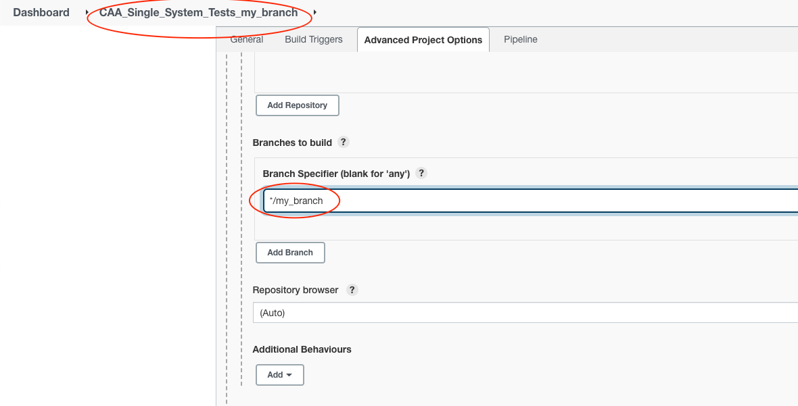

# SystemTests Development

## Setup locally

1. Clone systests repo
    ```sh
   git clone git@github.com:armosec/systests.git
   ```
2. Create virtual env
   ```sh
   ./create_env.sh
   ```
3. Activate virtual env
   ```sh
   source systests_python_env/bin/activate
   ```
4. Run profiled minikube (in case you do not have a kubernetes cluster)
   1. Start minikube
      ```sh
        minikube start -p <minikube-name>
      ```
   2. Update `~/.bashrc`/`~/.zprofile` file
      ```sh
      eval $(minikube -p <minikube-name> docker-env)
      ```
5. Execute systemtest command
    ```sh
   python systest-cli.py -t <test name> -b production -c CyberArmorTest
   ```
   > In case of helm/KS testing, it is recommended to cleanup your local environment before running the test
   > * Cleanup kubescape local environment: ```kubescape config delete```
   > * Cleanup helm local environment: ```helm uninstall armo -n kubescape```

### Examples

#### List test names
```sh
python systest-cli.py --list t
```

#### Run test against ARMO production BE
```sh
python systest-cli.py -t <test name> -b production -c CyberArmorTest
```

#### Run test against ARMO development BE
```sh
python systest-cli.py -t <test name> -b development -c CyberArmorTest
```

#### Run test using kubescape dev branch & helm dev branch against ARMO production BE
```sh
python systest-cli.py -t <test name> -b production -c CyberArmorTest --kwargs ks_branch=dev helm_branch=dev
```

For an architectural overview of the testing framework, read `docs/TEST_INFRASTRUCTURE.md`.

## Working agreements

### Shared rules
- Keep every system test self-contained, deterministic, and idempotent. Tests must provision and clean up their own tenants, clusters, and fixtures (see `BaseTest.cleanup`) so they can run repeatedly in any environment.
- Register each runnable scenario in `system_test_mapping.json` with the correct `target`, `target_repositories`, `skip_on_environment`, and `owner`. Pipelines and other repositories consume this metadata to decide when to execute system tests.
- Reuse the orchestration helpers in `infrastructure/` and `systest_utils/` for interacting with external systems (backend API, Kubernetes, Helm, Docker). Avoid duplicating logic that already exists in these shared utilities.
- Store credentials, tokens, and environment-specific data outside the repository. Tests should read them from environment variables as documented in `readme.md`.
- Validate new scenarios locally and in the duplicated Jenkins single-test job before merging, ensuring parity with the automated pipelines.

### System-tests repo rules
- Develop system tests only inside this repository. Service or dashboard repositories (for example `cadashboardbe`) should not be modified as part of test authoring; instead, interact with them via the API contracts exposed through `infrastructure/backend_api.py`.
- Organize domain-specific logic under `tests_scripts/<domain>/` and surface new entry points through the matching configuration module in `configurations/system/tests_cases/`.
- Keep auxiliary assets (YAML manifests, expected JSON, mock data) under the existing domain directories in `configurations/` or `resources/`, and reference them via the helpers in `systest_utils/statics.py`.
- When adding dependencies, update `requirements.txt`, regenerate the virtual environment with `create_env.sh`, and verify that `build.sh` still succeeds.
- Maintain logging via `systest_utils/tests_logger.py` so Jenkins and local runs retain consistent output and junit XML artifacts.

## Add new test

### Write a new test

Follow the flow below to introduce a new system test:

1. **Describe the scenario**  
   - Pick the domain that the test belongs to (e.g. kubescape, runtime, workflows).  
   - Identify any backend APIs, Kubernetes resources, or external services it touches.

2. **Prepare fixtures and expected data**  
   - Add Kubernetes manifests, network policies, or secrets under the relevant path in `configurations/k8s_workloads/` (or `resources/` for CLI inputs).  
   - Place expected JSON/XML outputs under the matching directory inside `configurations/expected-result` or `results_xml_format/`.  
   - Use helpers such as `TestUtil.get_abs_path` or `BaseTest.get_workload_templates_paths` when referencing these files from code.

3. **Author the executable test**  
   - Create or extend a class inside `tests_scripts/<domain>/`. Derive from the closest base class (`BaseTest`, `BaseKubescape`, `BaseK8S`, etc.) and implement a `start()` method.  
   - Leverage infrastructure wrappers (`infrastructure/helm_wrapper.py`, `infrastructure/backend_api.py`, `tests_scripts/kubernetes/...`) for cluster operations, tenant management, and API interactions.  
   - Ensure `start()` returns the tuple produced by `cleanup()` and that all resources are cleaned in success and failure paths (use `failed()` if you need the framework to handle cleanup after exceptions).

4. **Expose the test via configuration**  
   - Add a new `@staticmethod` to the appropriate file in `configurations/system/tests_cases/`, returning either `TestConfiguration`, `KubescapeConfiguration`, or another domain-specific configuration object.  
   - Populate arguments such as `create_test_tenant`, `yaml`, `framework_file`, `expected_results`, and any custom kwargs the script consumes.

5. **Register the scenario**  
   - Append an entry in `system_test_mapping.json` with the new test name, setting `target`, `target_repositories`, `skip_on_environment`, `description`, and `owner`. This ensures CI/CD jobs and other repositories can discover the test.

6. **Run locally**  
   - Activate the virtual environment and execute `python systest-cli.py -t <test-name> -b <backend> -c <customer>` with any required `--kwargs` overrides.  
   - Use `--list` to confirm the test is exposed and rerun until it passes consistently.

7. **Validate in Jenkins**  
   - Duplicate the `CAA_Single_System_Tests` job, point it to your branch, and confirm the test succeeds in the pipeline.  
   - Once stable, update the relevant Jenkinsfile (`Jenkinsfile-helm-ks-be.groovy`, `Jenkinsfile_helm_chart.groovy`, or `Jenkinsfile_kubescape.groovy`) if the test must join a scheduled suite.

### Check your test before adding it to the pipeline
Before adding a test to the Jenkinsfiles pipeline, please make sure the test passes locally and in the Jenkins environment

1. Duplicate the `CAA_Single_System_Tests` Jenkinsjob and name it `CAA_Single_System_Tests_<My_Bramch>`
2. Edit the branch name



### Add new test to the pipelines

After your test passed in single test, you can add it to the pipeline.

There are three components we test:
* Armo BE
* Helm chart
* Kubescape

For this we have three different Jenkinsfiles:
* Armo BE - `Jenkinsfile-helm-ks-be.groovy`
* Helm chart - `Jenkinsfile_helm_chart.groovy`
* Kubescape - `Jenkinsfile_kubescape.groovy`

Make sure to update the relevant file/s once you complete developing your test
