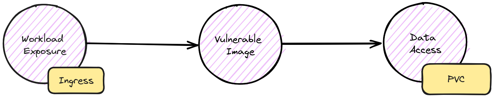

# Attack Chain #1



**workload-exposure / vulnerable-image / data-access**

## Steps to reproduce

Create the cluster with **kind** using the provided configuration file:

```shell
kind create cluster --config kind-config --name attack-chains
```

Install the **nginx ingress controller** with its manifest:

```shell
kubectl apply -f 01-nginx-ingress-controller.yaml
```

Install **mysql** and **wordpress** with their manifests:

```shell
kubectl apply -f 02-mysql.yaml
kubectl apply -f 03-wordpress.yaml
```

## Result

After creating the cluster and installing the manifests you should be able to see attack chain composed like so:

* **workload-exposure**: through an `Ingress` resource.
* **vulnerable-image**: `wordpress:6.0.1-php7.4` with some critical vulnerabilities, as reported here: [6.0.1-php7.4](https://hub.docker.com/layers/library/wordpress/6.0.1-php7.4/images/sha256-93802164c4fc8e21ef1f48f6ac96e76924aa535d26e1ca67dece41a8b223ca0b?context=explore).
* **data-access**: with a mount point from a `PersistentVolumeClaim`.
