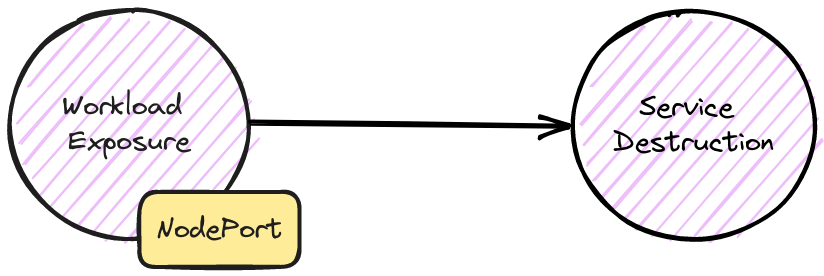

# Attack Chain #7



**workload-exposure / service-destruction**

## Steps to reproduce

Create the cluster with **kind** using the provided configuration file:

```shell
kind create cluster --config kind-config --name attack-chains
```

Install **mysql** and **wordpress** with their manifests:

```shell
kubectl apply -f 01-mysql.yaml
kubectl apply -f 02-wordpress.yaml
```

## Result

After creating the cluster and installing the manifests you should be able to see attack chain composed like so:

* **workload-exposure**: through a `NodePort` service.
* **service-destruction**: with **wordpress** `Deployment` that has no CPU/Memory limits set.

